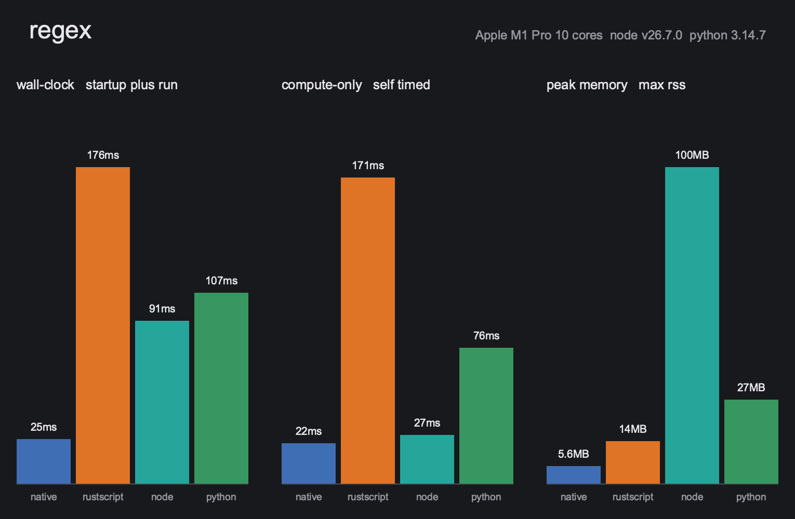
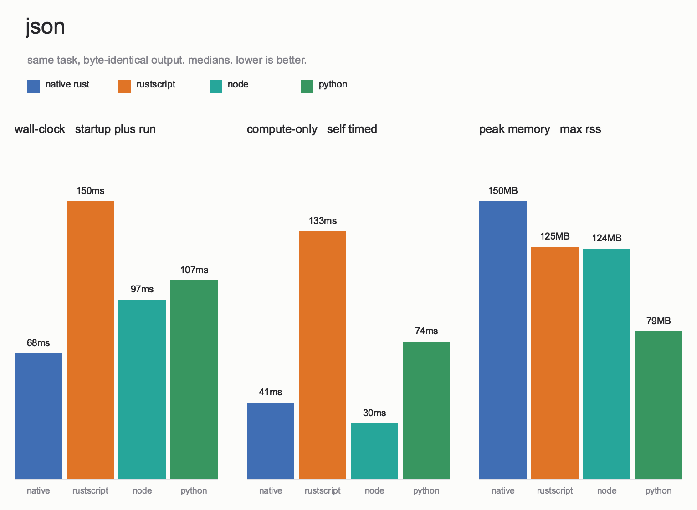

# RustScript

[](https://crates.io/crates/run-rs)
[](https://github.com/VladasZ/rustscript/actions/workflows/ci.yml)
[](https://github.com/marketplace/actions/rustscript-action)
[](#licence)

[](https://github.com/VladasZ/rustscript/releases/latest)
[](https://github.com/VladasZ/rustscript/releases/latest)
[](https://github.com/VladasZ/rustscript/releases/latest)

Write helper scripts in `rust` and run them like shell scripts, with no
compile step. RustScript interprets a practical subset of the language, so a
script starts instantly. `rust check` validates the same file with the real
`rustc`.

How it works inside: [docs/interpreter.md](docs/interpreter.md)

## Install

```sh
cargo install run-rs
```

This installs a binary named `rust`.

## First script

```rust
#!/usr/bin/env rust

use std::fs;

fn main() -> anyhow::Result<()> {
    let text = fs::read_to_string("notes.txt")?;
    println!("{} lines", text.lines().count());
    Ok(())
}
```

Make it executable and run it:

```sh
chmod +x notes.rs
./notes.rs
```

## Usage

```text
rust FILE.rs         interpret the script
rust -e 'CODE'       run a snippet, arguments after CODE go to it
rust check FILE.rs   validate without running
rust build FILE.rs   compile, cache, and run a native binary
rust supported       list every bridged method per receiver
rust clean           clear cached checks and builds
rust update [VER]    install a release, the newest one by default
rust --version       show version and build information
```

Arguments after the file go to the script.

`./tool.rs cmp one two` does what `rust build` does and runs the binary with
`one two`. So `cmp` is reserved as a script's first argument.

## What works

Functions, closures, structs, enums, patterns, loops, iterators, `Vec`,
strings, maps, sets, `Option`, `Result`, `?`, formatting, modules and local
path crates. Async with `#[tokio::main]`, spawned tasks, timers and HTTP.
Traits with default methods, user `Display`, `Debug`, `Drop`, operator and
`Iterator` impls, associated consts, `u128` and `i128`. Real sharing through
`Rc`, `Arc`, `RefCell`, `Cell` and `Mutex`. Values copy on write, exactly like
compiled Rust.

The std bridge covers files, paths, stdio, processes, TCP, env, time and
collections. Bridged crates include
[`anyhow`](https://github.com/dtolnay/anyhow), [`serde`](https://serde.rs),
[`serde_json`](https://github.com/serde-rs/json),
[`reqwest`](https://github.com/seanmonstar/reqwest),
[`regex`](https://github.com/rust-lang/regex), [`tokio`](https://tokio.rs),
[`chrono`](https://github.com/chronotope/chrono),
[`rand`](https://github.com/rust-random/rand), and more. Windows builds also
bridge [`winreg`](https://github.com/gentoo90/winreg-rs),
[`windows-service`](https://github.com/mullvad/windows-service-rs), and
[`wmi`](https://github.com/ohadravid/wmi-rs).

The full generated list of bridged methods: [docs/supported.md](docs/supported.md)

Every feature has a working example under `crates/examples/examples`.

## Limitations

- Crates without a bridge stop with an `unsupported crate` error.
- `std::thread` is not supported, use `tokio` tasks.
- `static mut` is rejected. Plain statics behave like constants.
- Lifetimes and generic bounds mean nothing at runtime.
- Glob imports from script modules are not supported.
- `HashMap` iterates in insertion order. Real Rust promises no order, so a
  correct script cannot see the difference.

## GitHub Actions

The repository is also a GitHub Action:

```yaml
- uses: VladasZ/rustscript@v0.6
  with:
    script: tools/release.rs
```

It downloads a prebuilt binary for `Linux`, `macOS` and `Windows` on x86_64
and arm64. Details: [docs/github-actions.md](docs/github-actions.md)

## Benchmarks

RustScript is compared with native `rust`, `node` and `python` on the same
programs. Charts: [bench/RESULTS.md](bench/RESULTS.md), method:
[bench/README.md](bench/README.md), profiling: [docs/profiling.md](docs/profiling.md)





## Licence

Dual licensed under either [MIT](LICENSE-MIT) or
[Apache-2.0](LICENSE-APACHE), at your option.
